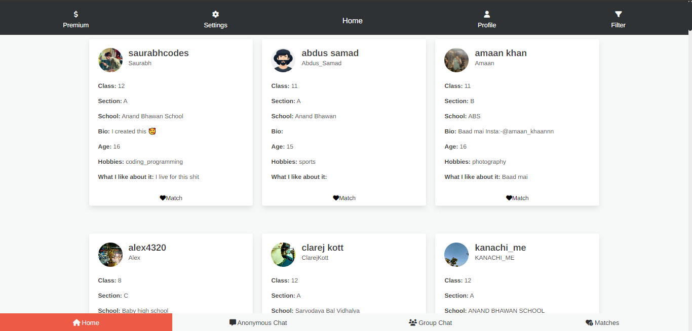
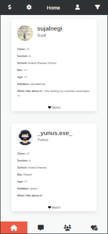
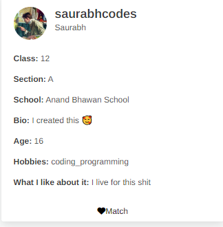

<h1 align="center">Cupid's Diary ❤️</h1>

  Welcome to <strong>Cupid's Diary</strong>, an app crafted for school-going teens looking to connect and discover mutual interests. With Cupid’s help, you can finally answer that classic question: <em>"Do they like me back?"</em>

  

  
  
  
  
  

## 🏹 Project Vision

<strong>Cupid's Diary</strong> is a modern take on high school matchmaking, designed to give teens a safe and friendly space to connect and find mutual interests. With over <strong>100 users</strong> and <strong>10+ relationships formed</strong>, the app is already building connections!

<em>Story</em>: Cupid’s Diary is where Cupid records connections in his digital diary. With every match, a new entry is made, helping two people find each other in a fun, secure way.

---

## ✨ Features

  

- **Matchmaking Algorithm**: Only matches those who have mutual interest to ensure connections are meaningful.
- **Anonymous Random Chat** *(Coming Soon)*: Chat with others anonymously for a fun, low-pressure conversation.
- **Swipe-Based Matching** *(Coming Soon)*: Find someone who catches your eye with a Tinder-like swipe feature.
- **Forgot Password** *(Upcoming)*: Password recovery is on the way for easy access!

---

## 🖥️ Technology Stack

- **Frontend**: HTML, CSS, Bulma CSS for a simple, responsive UI.
- **Backend**: Flask and SQLite for efficient, lightweight functionality.
- **Deployment**: The APK is hosted on [PythonAnywhere](http://cupidsdownload.pythonanywhere.com), allowing users to download *Cupid’s Diary* directly.

With no dependencies or installation needed, *Cupid’s Diary* is easy to use and accessible.

---

## 🌐 Accessing the App

You can enjoy *Cupid’s Diary* in two ways:
1. **Webview Application**: Get started from your browser.
2. **Downloadable APK**: Download the app on your phone from [cupidsdownload.pythonanywhere.com](http://cupidsdownload.pythonanywhere.com).

  

---

## 📚 Usage Guide

Using *Cupid's Diary* is simple:

1. **Sign Up/Login**: Create an account to get started.
2. **Create Your Profile**: Introduce yourself so others can get a glimpse of who you are.
3. **Match & Connect**: Check for mutual interest and let Cupid work his magic.
4. **Chat Anonymously** *(Coming Soon)*: Start a conversation without revealing your identity for a safe, anonymous experience.
5. **Swipe to Find Matches** *(Coming Soon)*: Swipe right to connect and find new friends or potential relationships.

  

---

## 🚀 Future Plans

Cupid’s Diary is just starting! Here’s what’s coming up:
- **Forgot Password** feature for seamless access.
- **Anonymous Random Chat** for fun, friendly interactions.
- **Swipe-Based Matching** for a fast way to connect.
- Ongoing UI and performance improvements.

---

## 🧑‍🤝‍🧑 Contributions & Community

Interested in helping *Cupid's Diary* grow? Contributions are welcome! Here’s how:

1. **Fork** the repo.
2. **Create a new branch** (`git checkout -b feature-name`).
3. **Commit** your changes.
4. Open a **Pull Request** with details about your changes.

The codebase is beginner-friendly, with simple HTML, CSS, and Flask components.

---

<h2>Author</h2>

Cupid's Diary was created by <a href="https://github.com/Rexaintreal">Saurabh Tiwari</a>.

  <a href="mailto:saurabhtiwari7986@gmail.com">Email Saurabh</a>

---

## 💡 You may also like...

- [Libro Voice](https://github.com/Rexaintreal/Libro-Voice) - A PDF to Audio Converter
- [Snippet Vision](https://github.com/Rexaintreal/Snippet-Vision) - A Youtube Video Summarizer
- [Weather App](https://github.com/Rexaintreal/WeatherApp) - A Python Weather Forecast App
- [Python Screenrecorder](https://github.com/Rexaintreal/PythonScreenrecorder) - A Python Screen Recorder
- [Typing Speed Tester](https://github.com/Rexaintreal/TypingSpeedTester) - A Python Typing Speed Tester
- [Movie Recommender](https://github.com/Rexaintreal/Movie-Recommender) - A Python Movie Recommender
- [Password Generator](https://github.com/Rexaintreal/Password-Generator) - A Python Password Generator
- [Object Tales](https://github.com/Rexaintreal/Object-Tales) - A Python Image to Story Generator
- [Finance Manager](https://github.com/Rexaintreal/Finance-Manager) - A Flask WebApp to Monitor Savings
- [Codegram](https://github.com/Rexaintreal/Codegram) - A Social Media Web App
- [Simple Flask Notes](https://github.com/Rexaintreal/Simple-Flask-Notes) - A Flask Notes App
- [Key5](https://github.com/Rexaintreal/key5) - Python Keylogger

